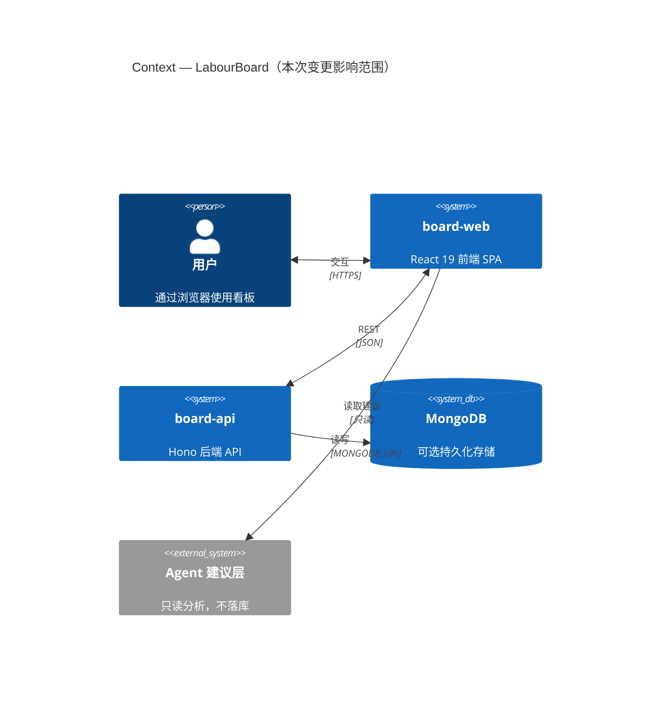
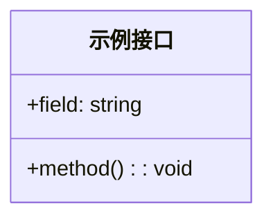
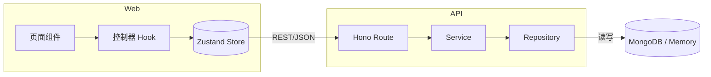

## 关联 issue

- Fixes / Closes: #<!-- 本 PR 交付的 issue 号 -->
- Blocked by: #<!-- 被阻塞的 issue，无则填"无" -->
- 分支命名：`feat/<issue号>-<短描述>` <!-- 如已按规范命名请保留 -->

## 变更摘要

<!-- 一句话说明本 PR 做了什么，涉及哪些模块 -->

## C4 图（mermaid）

> 画出本次变更影响的 C4 层级。**至少包含 Context（系统上下文）**；涉及模块内部改动时补充 Container / Component 层级。改动范围外保持原样，仅标注受影响的元素。



<!-- 如有 Container / Component 层级，在此追加 ```mermaid C4Container ... ``` 区块 -->

## UML（mermaid）

> 仅当本 PR 涉及领域模型 / 接口 / 类型契约变更时填写；纯前端样式或文案变更可删除本区块。



## 数据流图（mermaid）

> 画出本 PR 涉及的关键数据流：谁触发 → 经过哪些层 → 落到哪里 / 返回什么。



## 测试对象与目标（手动验证）

> 列出本 PR 的测试对象与验证目标，供手动验证核对。逐条列出"验证什么 → 期望结果"。

- [ ] 对象：<!-- 如：设置页列偏好保存 -->；目标：<!-- 如：刷新后列偏好保持 -->；期望：<!-- 如：列宽与顺序与保存前一致 -->

## 自动化测试记录

> 实际执行的命令与结果摘要（输出贴关键行）。提交前必须真实执行，勿留空。

```bash
# 示例（按实际改动范围调整）：
pnpm --filter @labour-board/shared build
pnpm --filter @labour-board/api typecheck
pnpm --filter @labour-board/api test
pnpm --filter @labour-board/web typecheck
pnpm --filter @labour-board/web lint
```

```
执行结果摘要：
- api typecheck: PASS（X 个文件无错误）
- api test: PASS（478 passed）
- web lint: PASS
- ...
```

## 文档同步

> 文档随代码维护：本 PR 改动的模块，其 `docs/modules/*.md` 与 `docs/architecture/*.md` 是否已同步？如无对应文档，说明原因。

- [ ] `docs/` 中相关模块文档与图已同步（或说明"不涉及文档化模块"）
