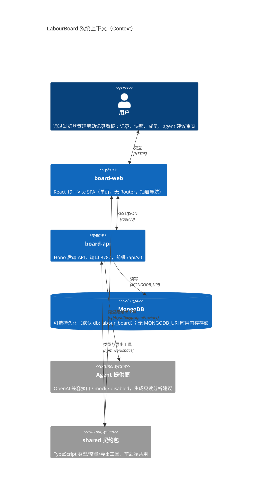
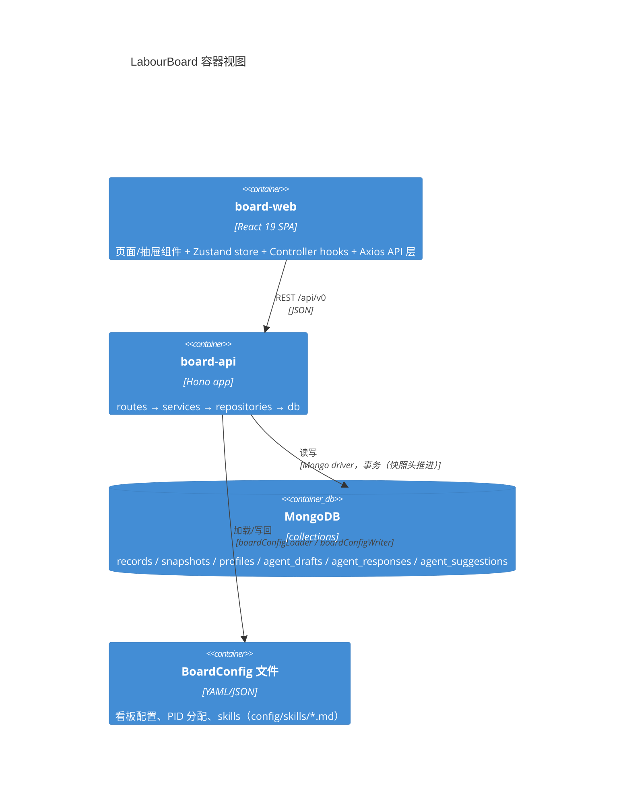

# C4 架构图 — LabourBoard

> 维护规则：改动路由/服务/存储/前端分层时同步本图。图内名称与代码符号一致（见各模块文档 `docs/modules/*.md`）。

## Level 1 — Context（系统上下文）



## Level 2 — Container（容器）



## Level 3 — Component（组件）

### board-api 组件

```mermaid
C4Component
    title board-api 组件（routes → services → repositories）

    Container_Boundary(api, "board-api") {
        Component(routes, "routes/", "Hono 路由工厂", "board / config / profiles / patches / snapshots / records / agent")
        Component(services, "services/", "业务逻辑", "RecordService / SnapshotService / ConfigService / ProfileService / AgentDraftService / AgentResponseService / AgentSkillService / AgentSuggestionService")
        Component(repos, "repositories/", "数据访问（Memory + Mongo 双实现）", "Record / SnapshotHead / Snapshot / Profile / AgentDraft / AgentResponse / AgentSuggestion")
        Component(providers, "config/", "Agent provider", "AgentSuggestionProvider（mock / openai-compatible / disabled）+ 预算/超时/重试")
        Component(http, "http/", "响应助手", "ok() / error()")
    }

    Rel(routes, services, "调用")
    Rel(services, repos, "读写")
    Rel(services, providers, "生成建议")
    Rel(repos, db, "MongoDB")
    Rel(repos, memory, "内存存储（默认）")
```

### board-web 组件

```mermaid
C4Component
    title board-web 组件分层

    Container_Boundary(web, "board-web") {
        Component(pages, "pages/", "页面", "BoardCurrentPage（唯一页面，聚合全部抽屉）")
        Component(comp, "components/", "组件", "BoardView / RecordCard / RecordDetailDrawer / CreateRecordDrawer / SnapshotDrawer / AgentDraftsDrawer / AppSettingsDrawer / agentDrafts/* / recordDetailEdit/* / ui/*")
        Component(hooks, "hooks/", "Controller hooks", "useBoardViewModel / useBoardStatusDnd / useStatusMoveController / useRecordHistoryController / useSnapshotController / useBoardExportController / useAgentDraftController(+Suggestion) / useBoardCurrentStore 内置加载")
        Component(stores, "stores/", "Zustand", "useBoardCurrentStore（投影+过滤+局部更新）/ useBoardMetadataStore（config+profiles）")
        Component(api, "api/", "Axios 客户端", "records / patches / recordHead / history / snapshots / exports / boardCurrent / config / profiles / agentDrafts / agentSuggestions / agentResponses")
    }

    Rel(pages, comp, "组合")
    Rel(comp, hooks, "调用")
    Rel(hooks, stores, "读写状态")
    Rel(hooks, api, "请求")
    Rel(api, boardApi, "REST /api/v0")
```

## 变更记录

| 日期 | 变更 | 对应 commit |
| --- | --- | --- |
| 2026-08-08 | 初版：基于 P10-P12 后代码（commit 79e6798）绘制 | cc07945 |
