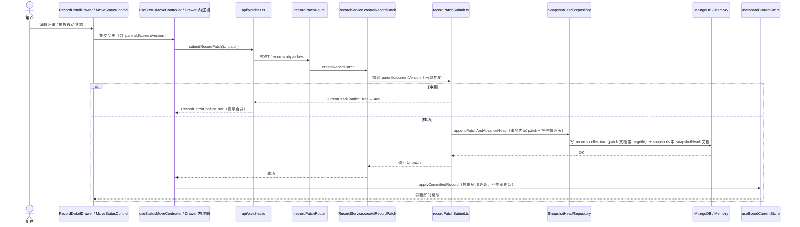
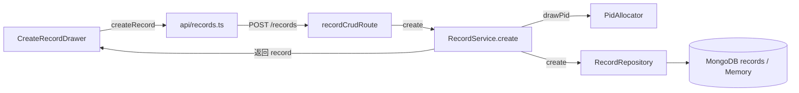
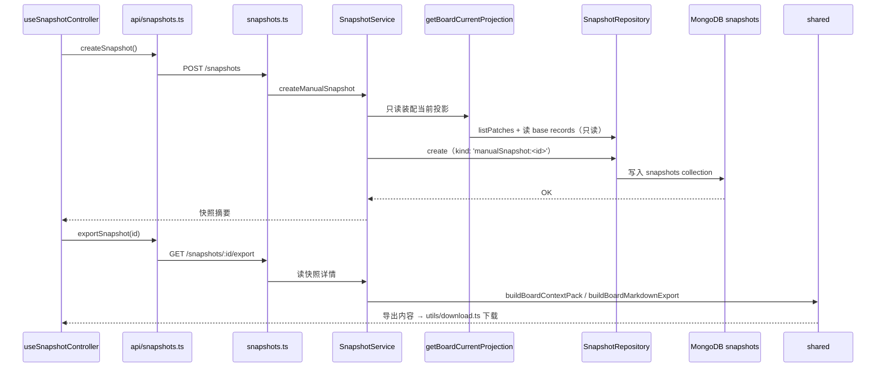
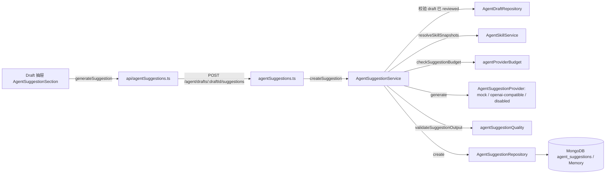
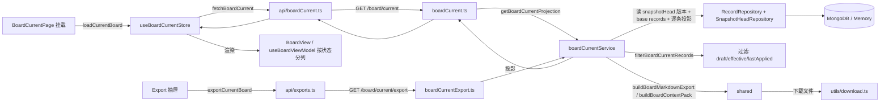

# 数据流图 — LabourBoard

> 维护规则：链路涉及的类/端点改名或增减时同步本图。对应代码位置见各图下方引用。

## 1. 记录保存（patch 提交）链路

**要点**：`records` 与 `patch` 存同一 collection，用 `targetId` 是否存在区分（base record 无 `targetId`，patch 有）；并发冲突通过 `parentId + currentVersion` 校验，返回 409。`snapshotHead` 不是独立 collection，而是 `snapshots` collection 中 `kind: 'snapshotHead'` 的文档（`version` + `records: { [recordId]: lastPatchId }`）；手动快照为 `kind: 'manualSnapshot:<id>'`。

## 2. 记录创建链路

## 3. 快照创建与导出链路

## 4. Agent 建议（只读分析）链路

**要点**：本链路**全程不写看板数据**（不触碰 records/snapshots），是只读分析产物；建议经人工 review（PATCH `/agent/suggestions/:id/review`）后才进入交接流程。

## 5. 看板加载与导出链路

## 变更记录

| 日期 | 变更 | 对应 commit |
| --- | --- | --- |
| 2026-08-08 | 初版：基于 P10-P12 后代码（commit 79e6798）绘制 | cc07945 |
