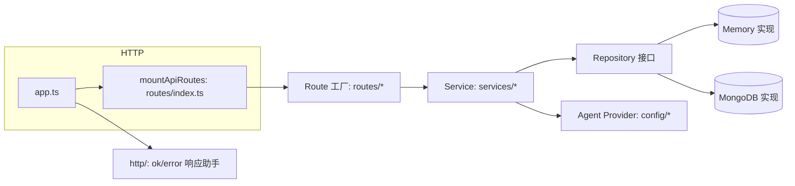
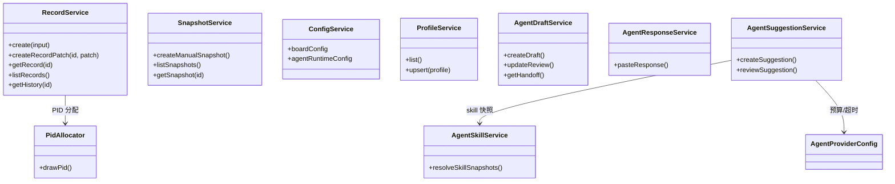

# 模块文档 — board-api（后端）

> 对应代码：`apps/board-api/src/`。改动本模块时同步更新本文档与 `docs/architecture/c4.md`、`docs/architecture/dataflow.md`。

## 职责与边界

Hono 后端，端口 8787，路由前缀 `/api/v0`。**MongoDB 可选**：有 `MONGODB_URI` 用 Mongo 实现，否则用内存存储。所有 repository 均为「interface + Memory 实现 + Mongo 实现」双实现，由 `createApiServices`（`services/index.ts`）按 env 选择。

## 分层

## 路由清单（`routes/`）

| 挂载路径 | 文件 | 端点 |
| --- | --- | --- |
| `/api/v0/board` | `boardCurrent.ts` / `boardCurrentExport.ts` | GET `/current`、GET `/current/export` |
| `/api/v0/config` | `config.ts` | GET `/` |
| `/api/v0/profiles` | `profiles.ts` | GET `/`、GET `/:pk`、POST `/`、PATCH `/:pk` |
| `/api/v0/patches` | `patches.ts` | GET `/?targetId=`、GET `/:id` |
| `/api/v0/snapshots` | `snapshots.ts` | POST `/`、GET `/`、GET `/:id`、GET `/:id/export` |
| `/api/v0/records` | `records/index.ts`（聚合 4 子路由） | recordCrud：GET `/`、GET `/:id`、POST `/`；recordHead：GET `/:id/head`；recordPatch：POST `/:id/patches`；recordHistory：GET `/:id/history` |
| `/api/v0/agent` | `agentDrafts.ts` / `agentSkills.ts` / `agentSuggestions.ts` | drafts 6 端点、responses 3 端点；GET `/skills`、GET `/skills/:skillId`；POST/GET drafts 建议、GET `/:id`、PATCH `/:id/review` |

## 服务层（`services/`）

| Service | 职责 | 关键内部 |
| --- | --- | --- |
| `RecordService` | 记录 CRUD、patch 提交、历史、PID 分配 | `PidAllocator`（`pid/pidAllocator.ts`）；patch 校验委托 `record/recordPatchSubmit.ts`（`parentId`/`currentVersion` 乐观并发，冲突抛 409） |
| `SnapshotService` | 手动快照创建/列表/读取/导出 | 投影装配只读，写 `snapshots` collection |
| `ConfigService` | 持有 BoardConfig + AgentRuntimeConfig | — |
| `ProfileService` | 成员 CRUD | — |
| `AgentDraftService` | 生成 agent 上下文草稿 | — |
| `AgentResponseService` | 粘贴外部 agent 响应 | — |
| `AgentSkillService` | 从 `config/skills/` 读内置 skill markdown | — |
| `AgentSuggestionService` | 调 provider 生成 AI 建议（只读，不写看板数据） | 预算检查 → provider.generate → 质量校验 → 落库 |

## 数据访问（`repositories/`）

| Repository | Mongo collection | 说明 |
| --- | --- | --- |
| `RecordRepository` | `records`（id unique + pid index） | base record 与 patch 同 collection，`targetId` 是否存在区分 |
| `SnapshotHeadRepository` | `snapshots`（kind unique） | `appendPatchAndAdvanceHead` 用 **Mongo 事务**原子写 patch + 推进快照头；`SnapshotHead` = `{kind:'snapshotHead', version, records:{id→lastPatchId}}` |
| `SnapshotRepository` | `snapshots` | 快照实体 |
| `ProfileRepository` | `profiles`（pk unique） | 成员 |
| `AgentDraftRepository` | `agent_drafts` | 草稿 |
| `AgentResponseRepository` | `agent_responses` | 外部响应 |
| `AgentSuggestionRepository` | `agent_suggestions` | 建议（含 review 状态） |

## Agent Provider（`config/`）

`AgentProviderKind = 'mock' | 'disabled' | 'openai-compatible'`，由 `agentSuggestionProviderFactory.ts` 按 env 创建：

- `MockAgentSuggestionProvider` — 测试用
- `DisabledAgentSuggestionProvider` — 关闭
- `openAICompatibleSuggestionProvider` — 真实客户端（超时/重试/预算）

预算、超时、重试配置见 `agentProviderConfig.ts`。

## 数据流引用

- 记录保存（patch）链路：见 `docs/architecture/dataflow.md` §1-2
- 快照链路：§3
- Agent 建议只读链路：§4
- 看板加载/导出：§5

## 变更记录

| 日期 | 变更 | 对应 commit |
| --- | --- | --- |
| 2026-08-08 | 初版：基于 P10-P12 后代码 | cc07945 |
