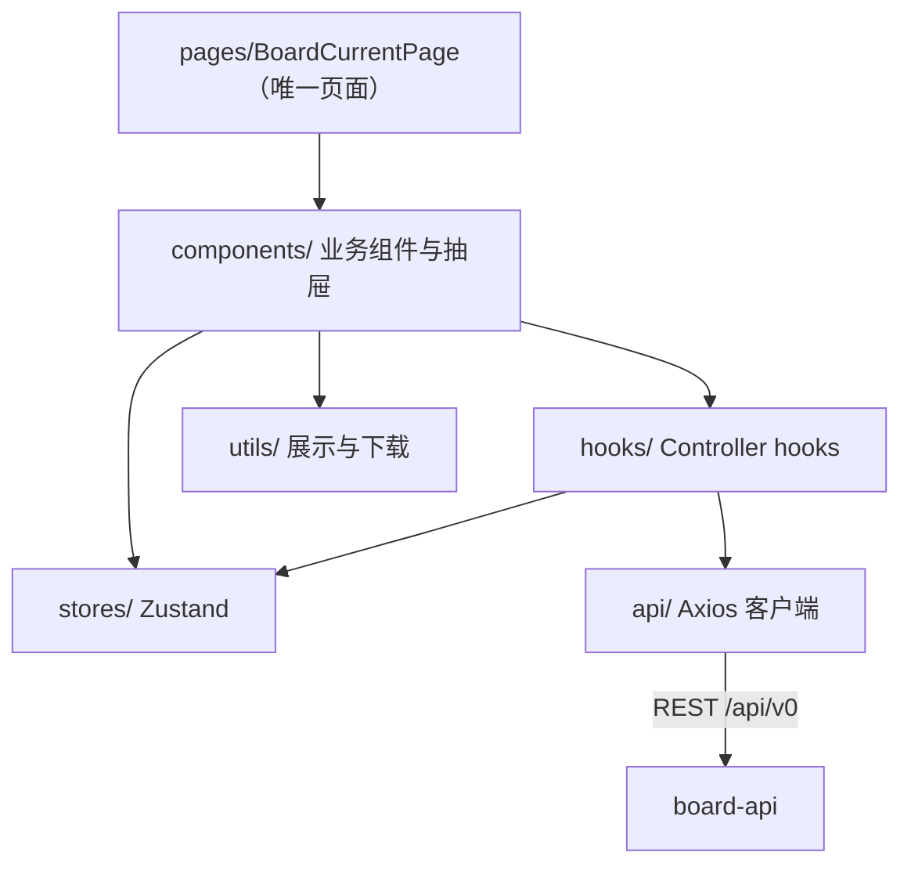

# 模块文档 — board-web（前端）

> 对应代码：`apps/board-web/src/`。改动本模块时同步更新本文档与 `docs/architecture/c4.md`、`docs/architecture/dataflow.md`。

## 职责与边界

React 19 + Vite 8 + Tailwind CSS 4 单页应用（**无 React Router**），抽屉（Drawer）管理模态导航。API 基础地址 `VITE_API_BASE_URL ?? '/api/v0'`。状态由 Zustand 管理，请求由 Controller hooks 发起（全部支持 `AbortController` 竞态取消）。

## 分层

## 状态管理（`stores/`）

| Store | 状态职责 | 关键行为 |
| --- | --- | --- |
| `useBoardCurrentStore` | 看板投影：draft/effective/lastApplied 过滤 + 投影缓存 | `loadCurrentBoard`（全量加载）、`applyCommittedRecord`（patch 成功后**局部更新投影**，不整页刷新） |
| `useBoardMetadataStore` | config + profiles 加载与增改 | — |

## Controller hooks（`hooks/`）

| Hook | 用途 |
| --- | --- |
| `useBoardViewModel` | 记录按状态分列、列排序/可见列 |
| `useBoardStatusDnd` | dnd-kit 状态列拖拽 |
| `useStatusMoveController` | 状态移动（→ `submitRecordPatch`） |
| `useRecordHistoryController` | 记录历史 |
| `useSnapshotController` | 快照列表/详情/创建/导出 |
| `useBoardExportController` | 当前看板导出 + 上下文包导出 |
| `useAgentDraftController` | agent draft 抽屉（列表/详情/创建/审查/交接），内部嵌套 `useAgentSuggestionController` |
| `useAgentSuggestionController` | 建议列表/详情/生成/审查 |

## API 客户端（`api/`）

| 文件 | 函数 |
| --- | --- |
| `records.ts` | `createRecord` |
| `patches.ts` | `submitRecordPatch`（409 → `RecordPatchConflictError`，成功后局部更新投影） |
| `recordHead.ts` | 读记录当前版本头 |
| `history.ts` | 记录历史 |
| `snapshots.ts` | 快照创建/列表/详情 |
| `exports.ts` | `exportCurrentBoard` / `exportSnapshot` |
| `boardCurrent.ts` | `fetchBoardCurrent` |
| `config.ts` / `profiles.ts` | 配置与成员 |
| `agentDrafts.ts` | 5 个草稿函数 |
| `agentSuggestions.ts` | 4 个建议函数 |
| `agentSkills.ts` | 2 个 skill 函数 |
| `apiError.ts` | 错误类型 |

## 页面与关键组件

- **页面**：`pages/BoardCurrentPage.tsx`（约 30KB，聚合全部抽屉）
- **顶层组件**：`BoardView`、`BoardFilters`、`RecordCard`、`RecordDetailDrawer`（最大）、`CreateRecordDrawer`、`SnapshotDrawer`、`AgentDraftsDrawer`、`ExportContextDrawer`、`AppSettingsDrawer`、`AdvancedFiltersDrawer`、`ProfileManagerDrawer`、`RecordHistoryContent`、`MoveStatusControl`、`BoardStatusDropColumn`、`IssuesPanel`、`ViewModeToggle`
- **agentDrafts/**：`AgentDraftDetailWorkspace`、`AgentDraftQueuePanel`、`AgentPatchDraftPanel`、`ManualAgentResponseSection`、`FormalHandoffSection`、`AgentSuggestionSection/List/Card/DetailPanel/SkillsPanel/Toolbar/AuditPanel/DiagnosticsPanel` 等
- **recordDetailEdit/**：`EditableSection`、`UnsavedChangesDialog`、`useSectionEditState`
- **ui/**：`Button`、`Badge`、`Select`、`SearchSelect`、`TextInput`、`SwitchField`、`Panel`、`MarkdownPreview`、`AnimatedDrawer`、`ToastViewport`

## 数据流引用

- 记录保存（Drawer/状态移动 → patch API → 局部投影更新）：`docs/architecture/dataflow.md` §1
- 记录创建：§2
- 快照：§3
- Agent 建议（只读生成 + 人工 review）：§4
- 看板加载/导出：§5

## 变更记录

| 日期 | 变更 | 对应 commit |
| --- | --- | --- |
| 2026-08-08 | 初版：基于 P10-P12 后代码 | cc07945 |
