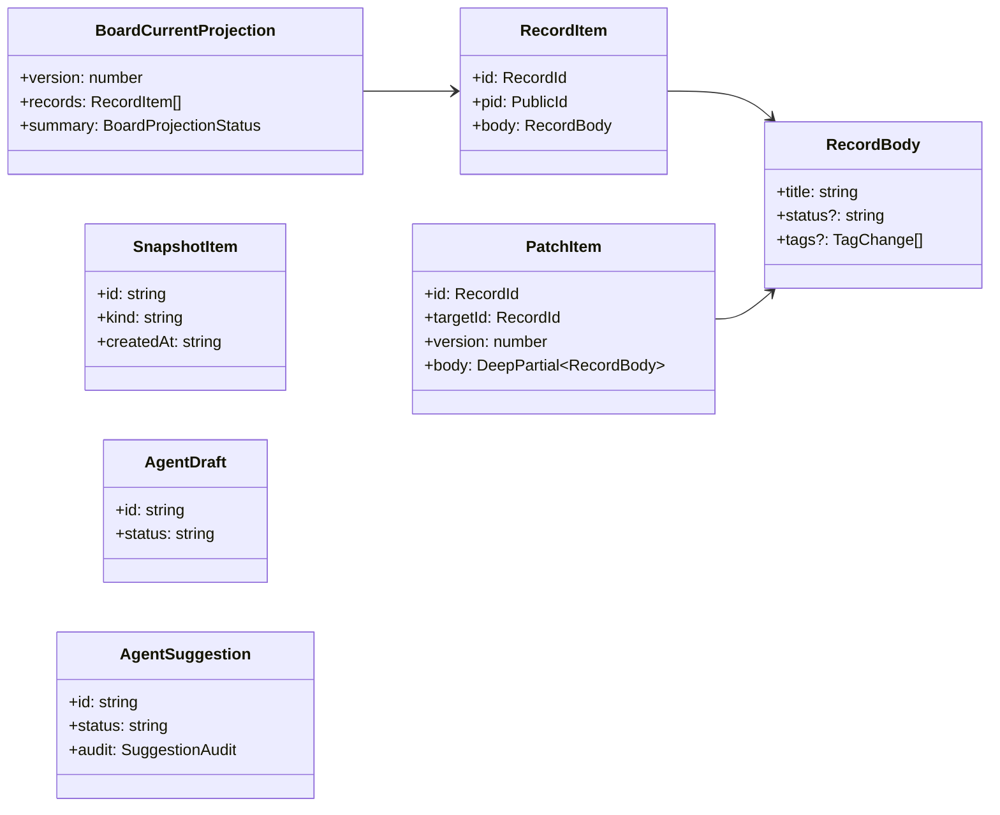
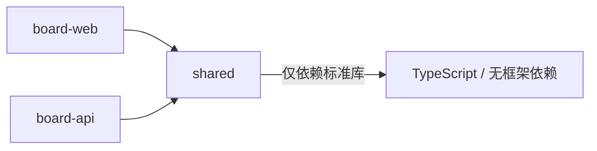

# 模块文档 — shared（共享契约包）

> 对应代码：`packages/shared/src/`。改动本模块时同步更新本文档。**本包必须先构建**（`pnpm --filter @labour-board/shared build`），API/Web typecheck 依赖其 `composite: true` 项目引用。

## 职责与边界

前后端共用的 TypeScript 契约：接口类型、常量、导出与过滤工具。**不含任何运行时业务逻辑**（除纯函数工具），不依赖 React/Hono。

## 目录

```
src/
├── interfaces/   # 类型契约（index.ts 统一导出）
├── constants/    # 配置 schema、默认值、标签、profile 定义
└── utils/        # 纯函数工具（patch 应用、导出、过滤、交接）
```

## 核心接口（`interfaces/`）



| 文件 | 核心类型 |
| --- | --- |
| `record.ts` | `RecordId` / `PublicId` / `PublicKey` / `RecordBody` / `CardBody` / `AssetBody` / `RecordItem` / `RelationRef` / `AssetRef` |
| `api.ts` | `ApiResponse` / `ApiError` / `RecordQuery` / `CreateRecordInput` / `CreateRecordPatchInput` / `RecordCurrentHeadResponse` / `RecordHistoryResponse`（+Replay/Reference/Diagnostic）/ `RecordResponse` |
| `boardCurrent.ts` | `BoardCurrentProjection` / `Query` / `Summary` / `TagMatch` / `BoardProjectionStatus` / `BlockedRecordEntry` / `ProjectionDiagnostic` |
| `patch.ts` | `DeepPartial` / `PatchItem` / `TagChange` / `TagChanges` |
| `snapshot.ts` | `SnapshotItem` / `Summary` / `Detail` / `Source` / `CreateSnapshotInput` |
| `agent.ts` | `AgentDraft*` / `AgentResponse*` / `AgentSkill*` / `AgentSuggestion*`（Status/Audit/Summary/Detail/Create/Update/Review） |
| `export.ts` | `BoardExportFormat` / `Level` / `Source` / `Options` / `Result`、`BoardContextPackOptions/Result`、`AgentContextProfile`（7 种：agent-full/sprint/filtered/card/related/snapshot/human-summary） |
| 其他 | `boardConfig.ts` / `profile.ts` / `identity.ts`（Base58String）/ `sysRecord.ts`（SysRecord/RecordEnvelope/PatchEnvelope）/ `tag.ts` / `transaction.ts` |

## 常量与工具

| 目录 | 内容 |
| --- | --- |
| `constants/` | `agentContextProfiles.ts`（profile 定义+校验）、`boardConfig.ts`（DEFAULT_BOARD_CONFIG）、`schemas.ts`（RECORD_SCHEMAS）、`tags.ts`（默认标签） |
| `utils/` | `patch.ts`（applyRecordPatch / applyTagChanges / shouldIncludeInSnapshot / tagNamespace）、`tags.ts`、`boardExport.ts`（buildBoardMarkdownExport）、`boardContextPack.ts`（buildBoardContextPack）、`boardFilter.ts`、`exportReferenceDisplay.ts`、`contextPackI18n.ts`、`agentDraftHandoff.ts`（buildAgentDraftHandoffMarkdown） |

## 依赖方向



**规则**：shared 不得依赖 api/web 的任何代码；新增类型后同步导出至 `interfaces/index.ts`。

## 变更记录

| 日期 | 变更 | 对应 commit |
| --- | --- | --- |
| 2026-08-08 | 初版：基于 P10-P12 后代码 | cc07945 |
